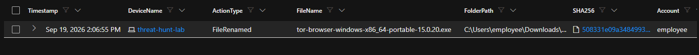
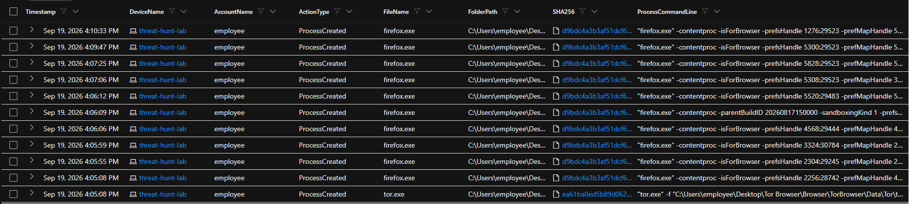

# Official [Cyber Range](http://joshmadakor.tech/cyber-range) Project


# Threat Hunt Report: Unauthorized TOR Usage
- [Scenario Creation](https://github.com/CSLedbetter/threat-hunting-scenario-tor/blob/main/threat-hunting-scenario-tor-event-creation.md)

## Platforms and Languages Leveraged
- Windows 11 Virtual Machines (Microsoft Azure)
- EDR Platform: Microsoft Defender for Endpoint
- Kusto Query Language (KQL)
- Tor Browser

##  Scenario

Management suspects that some employees may be using TOR browsers to bypass network security controls because recent network logs show unusual encrypted traffic patterns and connections to known TOR entry nodes. Additionally, there have been anonymous reports of employees discussing ways to access restricted sites during work hours. The goal is to detect any TOR usage and analyze related security incidents to mitigate potential risks. If any use of TOR is found, notify management.

### High-Level TOR-Related IoC Discovery Plan

- **Check `DeviceFileEvents`** for any `tor(.exe)` or `firefox(.exe)` file events.
- **Check `DeviceProcessEvents`** for any signs of installation or usage.
- **Check `DeviceNetworkEvents`** for any signs of outgoing connections over known TOR ports.

---

## Steps Taken

### 1. Searched the `DeviceFileEvents` Table

Searched for any file that had the string "tor-browser" in it and discovered that the user "employee" downloaded a TOR installer. The file `tor-browser-windows-x86_64-portable-15.0.20.exe` appeared in the Downloads folder at `2026-09-19T21:06:55Z` with the action type `FileRenamed`, which is how a completed browser download is logged.

An earlier, broader search for the string "tor" also returned many TOR-related files copied to the desktop and a file called `tor-shopping-list.txt` created on the desktop at `2026-09-19T23:09:08.7550973Z`. That broader filter was dropped because it also matched unrelated file names such as "editor" and "storage".

**Query used to locate events:**

```kql
DeviceFileEvents  
| where DeviceName == "threat-hunt-lab"  
| where InitiatingProcessAccountName == "employee"  
| where FileName contains "tor-browser"  
| where Timestamp >= datetime(2026-09-19T13:45:00.6065231Z)  
| order by Timestamp desc  
| project Timestamp, DeviceName, ActionType, FileName, FolderPath, SHA256, Account = InitiatingProcessAccountName
```



---

### 2. Searched the `DeviceProcessEvents` Table

Searched for any `ProcessCommandLine` that contained the string "tor-browser-windows-x86_64-portable-15.0.20.exe". Based on the logs returned, at `2026-09-19T21:13:43.8171334Z`, an employee on the "threat-hunt-lab" device ran the file `tor-browser-windows-x86_64-portable-15.0.20.exe` from their Downloads folder, using a command that triggered a silent installation.

**Query used to locate event:**

```kql

DeviceProcessEvents  
| where DeviceName == "threat-hunt-lab"  
| where ProcessCommandLine contains "tor-browser-windows-x86_64-portable-15.0.20.exe"  
| project Timestamp, DeviceName, AccountName, ActionType, FileName, FolderPath, SHA256, ProcessCommandLine
```


---

### 3. Searched the `DeviceProcessEvents` Table for TOR Browser Execution

Searched for any indication that user "employee" actually opened the TOR browser. There was evidence that they did: `tor.exe` and `firefox.exe` (TOR) processes were created at `2026-09-19T23:05:08Z`, and several more instances of `firefox.exe` were spawned afterwards.

**Query used to locate events:**

```kql
DeviceProcessEvents  
| where DeviceName == "threat-hunt-lab"  
| where FileName has_any ("tor.exe", "firefox.exe", "tor-browser.exe")  
| project Timestamp, DeviceName, AccountName, ActionType, FileName, FolderPath, SHA256, ProcessCommandLine  
| order by Timestamp desc
```



---

### 4. Searched the `DeviceNetworkEvents` Table for TOR Network Connections

Searched for any indication the TOR browser was used to establish a connection using any of the known TOR ports. At `2026-09-19T23:05:21.2407521Z`, an employee on the "threat-hunt-lab" device successfully established a connection to the remote IP address `5.199.162.114` on port `9001`. The connection was initiated by the process `tor.exe`, located in the folder `c:\users\employee\desktop\tor browser\browser\torbrowser\tor\tor.exe`. There were a couple of other connections to sites over port `443`.

**Query used to locate events:**

```kql
DeviceNetworkEvents  
| where DeviceName == "threat-hunt-lab"  
| where InitiatingProcessAccountName != "system"  
| where InitiatingProcessFileName in ("tor.exe", "firefox.exe")  
| where RemotePort in ("9001", "9030", "9040", "9050", "9051", "9150", "80", "443")  
| project Timestamp, DeviceName, InitiatingProcessAccountName, ActionType, RemoteIP, RemotePort, RemoteUrl, InitiatingProcessFileName, InitiatingProcessFolderPath  
| order by Timestamp desc
```


---

## Chronological Event Timeline 

### 1. File Download - TOR Installer

- **Timestamp:** `2026-09-19T21:06:55Z`
- **Event:** The user "employee" downloaded a file named `tor-browser-windows-x86_64-portable-15.0.20.exe` to the Downloads folder.
- **Action:** File download detected (`FileRenamed`).
- **File Path:** `C:\Users\employee\Downloads\tor-browser-windows-x86_64-portable-15.0.20.exe`

### 2. Process Execution - TOR Browser Installation

- **Timestamp:** `2026-09-19T21:13:43.8171334Z`
- **Event:** The user "employee" executed the file `tor-browser-windows-x86_64-portable-15.0.20.exe` in silent mode, initiating a background installation of the TOR Browser.
- **Action:** Process creation detected.
- **Command:** `tor-browser-windows-x86_64-portable-15.0.20.exe /S`
- **File Path:** `C:\Users\employee\Downloads\tor-browser-windows-x86_64-portable-15.0.20.exe`

### 3. Process Execution - TOR Browser Launch

- **Timestamp:** `2026-09-19T23:05:08Z`
- **Event:** User "employee" opened the TOR browser. Processes associated with TOR browser, `tor.exe` and `firefox.exe`, were created, indicating that the browser launched successfully.
- **Action:** Process creation of TOR browser-related executables detected.
- **File Path:** `C:\Users\employee\Desktop\Tor Browser\Browser\TorBrowser\Tor\tor.exe`

### 4. Network Connection - TOR Network

- **Timestamp:** `2026-09-19T23:05:21.2407521Z`
- **Event:** A network connection to IP `5.199.162.114` on port `9001` by user "employee" was established using `tor.exe`, confirming TOR browser network activity.
- **Action:** Connection success.
- **Process:** `tor.exe`
- **File Path:** `c:\users\employee\desktop\tor browser\browser\torbrowser\tor\tor.exe`

### 5. Additional Network Connections - TOR Browser Activity

- **Timestamps:**
- `2026-09-19T23:05:21Z` - Multiple outbound connections detected to `212.51.155.254:9001`, `190.120.229.2:443`, and local proxy loopback `127.0.0.1:9150`.
- **Event:** Additional TOR network connections were established, indicating ongoing activity by user "employee" through the TOR browser.
- **Action:** Multiple successful connections detected.

### 6. File Creation - TOR Shopping List

- **Timestamp:** `2026-09-19T23:09:08.7550973Z`
- **Event:** The user "employee" created a file named `tor-shopping-list.txt` on the desktop, potentially indicating a list or notes related to their TOR browser activities.
- **Action:** File creation detected.
- **File Path:** `C:\Users\employee\Desktop\tor-shopping-list.txt`

---

## Summary

The user "employee" on the "threat-hunt-lab" device initiated and completed the installation of the TOR browser. They proceeded to launch the browser, establish connections within the TOR network, and created various files related to TOR on their desktop, including a file named `tor-shopping-list.txt`. This sequence of activities indicates that the user actively installed, configured, and used the TOR browser, likely for anonymous browsing purposes, with possible documentation in the form of the "shopping list" file.

---

## Response Taken

TOR usage was confirmed on the endpoint `threat-hunt-lab` by the user `employee`. The device was isolated, and the user's direct manager was notified.

---
